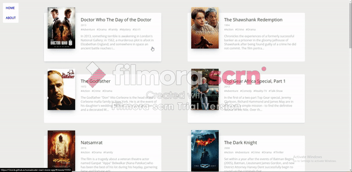

# Nomadcoder React Movie App

### 0. Objective

React.js의 기초 사용법을 알려주는 노마드코더 <a href="https://nomadcoders.co/react-fundamentals/lobby" target="_blank">"ReactJS로 영화 웹 서비스 만들기"</a> 강좌의 결과물입니다. 간단하게 영화 정보를 소개시켜주는 데모 웹사이트입니다. (2019년 개정판)

### 1. Features

- YTS API를 활용하여 데모용 영화 정보 수집
- 해당 영화에 대한 카드 클릭 시 세부 정보 조회
- 사이드 네비게이션 바를 활용하여 홈 화면과 About 페이지 이동

### 2. How to use

1. <a href="https://13circle.github.io/nomadcoder-react-movie-app" target="_blank">https://13circle.github.io/nomadcoder-react-movie-app</a> 으로 접속합니다.
2. 관심있는 영화를 클릭하여 자세한 정보를 조회합니다.
3. 상단 좌측의 사이드 바의 링크를 클릭하여 Home 화면과 About 페이지로 이동합니다.

### 3. Development Stack

- React (Front-end) - 해당 강좌의 목적이기도 하지만, 무엇보다 영화 정보별로 변화하는 상태에 대한 원활한 처리가 가능하기에 React를 사용하게 되었습니다.
   
   
- Axios (영화 정보 Fetching) - YTS API를 사용하여 영화 정보를 가져오려면 URL을 통해서 JSON을 받아와야 하는데, 이 영화 정보에 해당하는 JSON을 가져오기 위해서 Axios를 사용했습니다. 기존 자바스크립트에서 사용하는 fetch보다 상대적으로 편리하게 쓸 수 있다는 이점으로 선택하였습니다.
